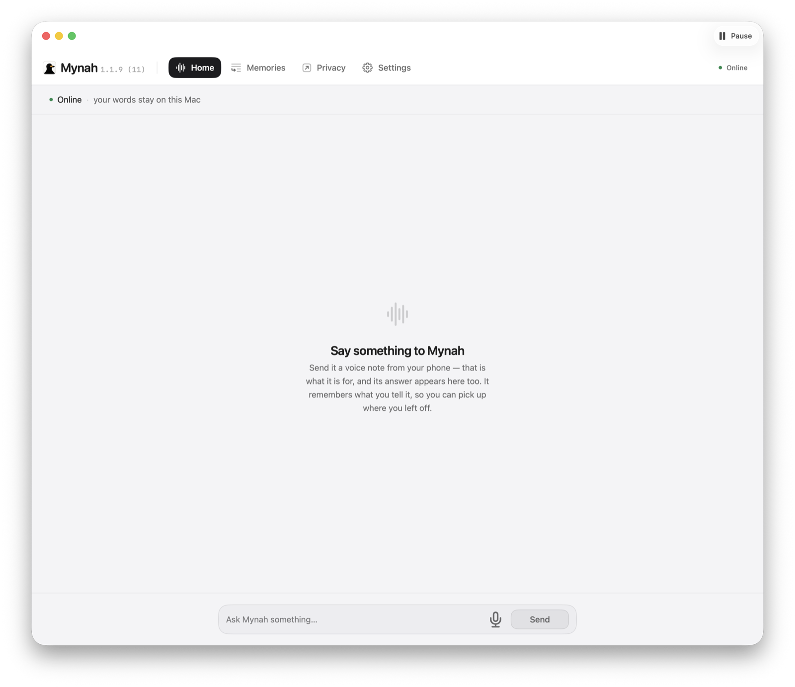
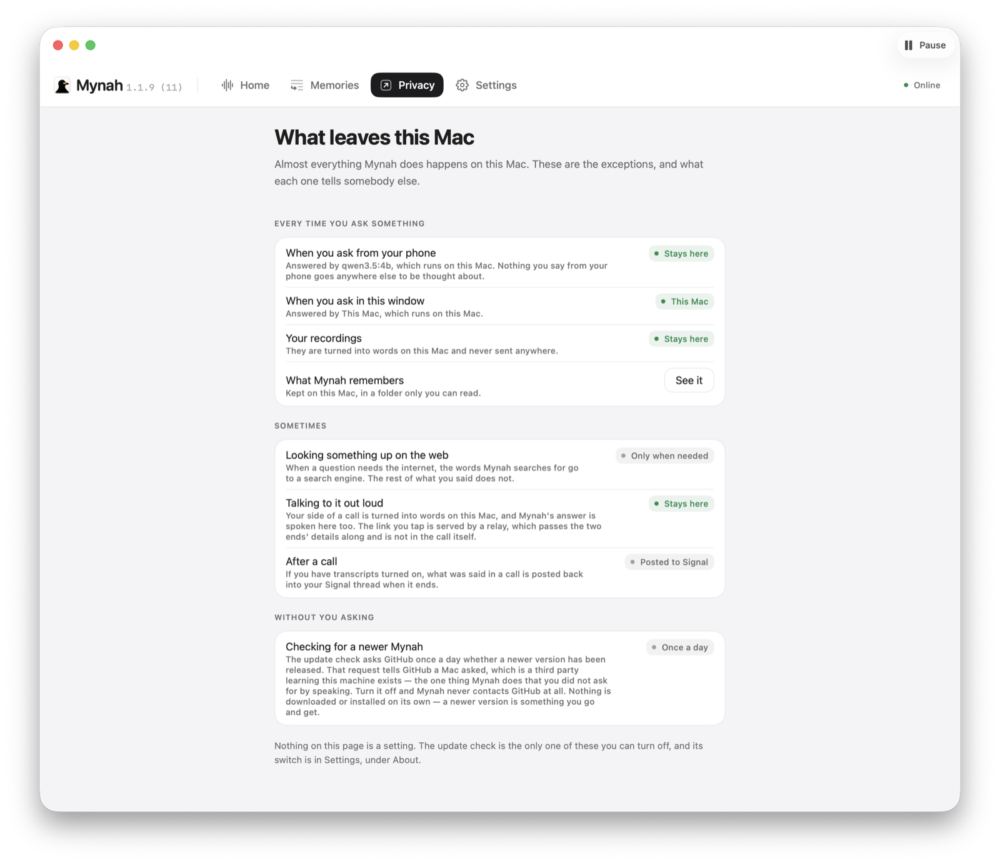
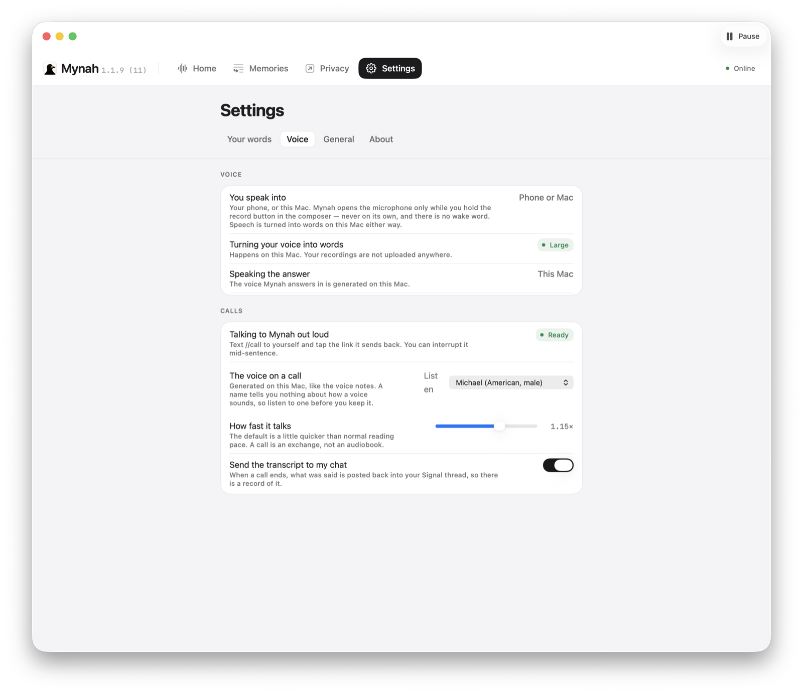
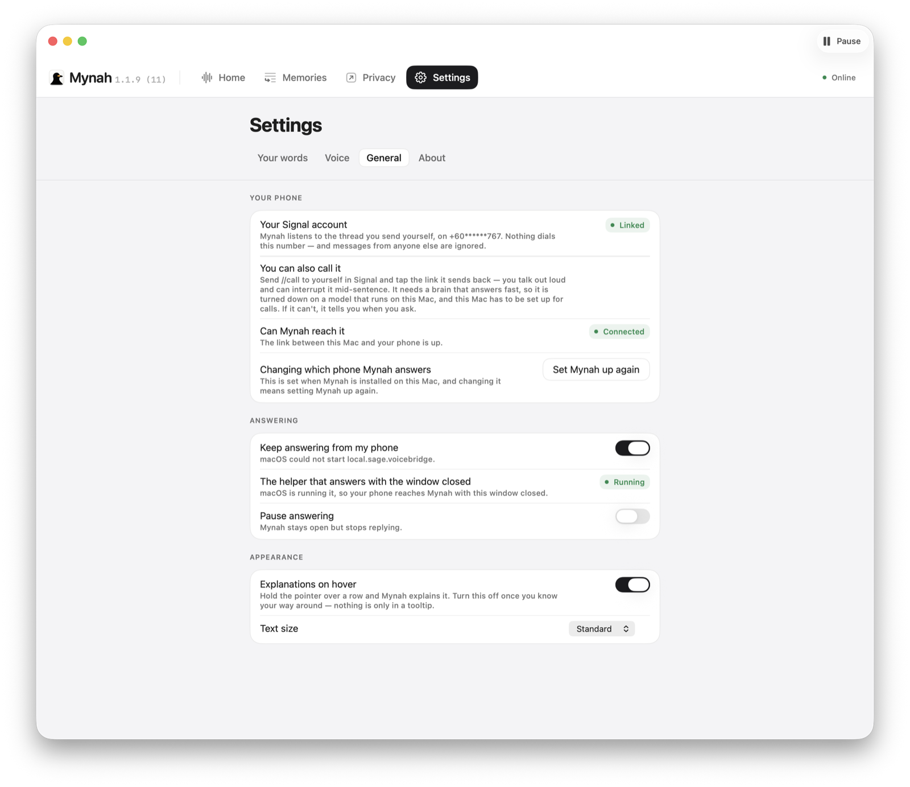

# Mynah (SAGE Voice Bridge): A Personal AI and Agent Manager

Mynah is a macOS app that runs a personal agent on a Mac you own and answers you
from your phone: you message your own Signal Note-to-Self thread, or you send
`//call` and talk to it out loud. Its memory lives in a
[SAGE](https://github.com/l33tdawg/sage) node it drives over MCP — everything it
remembers is stored there, and the other agents on that node are ones it can
find by name and hand work to.

**It's fully local and privacy-preserving by default.** Your words, your
memories and your notes stay on your own Mac, and the thinking happens there too.
A fresh install downloads Ollama and `qwen3.5:4b` and runs the model on your Mac
— you are not asked to choose, because a default nobody is given is not a
default. Pointing it at a cloud provider instead is something you go and do
afterwards, in Settings, deliberately. On a Mac that cannot run a model
locally — an Intel chip, too little memory, too little disk — it says which of
those it is, and *then* asks.

Nothing about it is a service: no account, no sign-in, no server of ours in the
message path. Where anything does leave the Mac, the app says so — the Privacy
screen names the model your words go to rather than leaving you to infer it, and
lists the other things that leave: the words a web search is made of, the call
relay that serves the link and passes the two ends' details along, a call
transcript posted back into the Signal thread if you have that turned on, and a
once-a-day update check against GitHub.

## What it looks like

<table>
  <tr>
    <td width="50%"></td>
    <td width="50%"></td>
  </tr>
  <tr>
    <td><b>Home.</b> What you say and what it says back, in one thread with the work it is holding.</td>
    <td><b>Privacy.</b> Every exception to "it stays on this Mac", named rather than implied.</td>
  </tr>
  <tr>
    <td></td>
    <td></td>
  </tr>
  <tr>
    <td><b>Voice.</b> Which voice answers, how fast it talks, whether a call is written back to Signal.</td>
    <td><b>General.</b> The phone it answers, the helper that keeps answering with the window shut.</td>
  </tr>
</table>

## What it does

- Answers text messages and voice notes in your Signal Note-to-Self thread.
- Takes a live voice call. You send `//call`, tap the link you get back, and
  talk; you can cut it off mid-sentence and it stops.
- Remembers across conversations rather than within one, in SAGE. The Memories
  screen lists what it remembers, searches by meaning, and forgets one on
  request.
- Searches the web when the answer was never yours to begin with — Brave when
  `BRAVE_SEARCH_API_KEY` is set, DuckDuckGo otherwise, so it works with no key.
- Writes, reads and lists notes as real files on the Mac, and exports them as
  PDF, Word or a deck where the converters are staged.
- Keeps whatever you send it — photos, tickets, PDFs — and sends any of it back
  when you ask, as a Signal attachment or as a file to click in the window. What
  it does with one depends on the kind: a picture is described where the brain
  can see (see [What the model can do](#what-the-model-can-do)); a document is
  filed and not read, because that is what a booking confirmation is sent for.
- Reminds you about dated work as the day approaches rather than on a fixed
  alarm, so a Mac that was asleep says "in about two hours" rather than
  yesterday's line. Things happening at the same time are grouped on the board.
- Finds another agent on your SAGE node from its own roster, hands it a job, and
  tells you what came back.
- Shows the work assigned to it on Home, read from `sage_backlog`.

## The two ways in

**Signal Note-to-Self.** You message yourself; Mynah answers in the same thread.
It links as a secondary device on your own Signal account, the same mechanism
Signal Desktop uses — no new number, no business account, no bot. A newly linked
device receives nothing sent before the link, so it cannot see your history.
Group messages are refused, and so is a message you sent from your phone to
somebody else; only the thread addressed to the linked account counts as a
command. It never opens a conversation on its own.

**Calls.** `//call` starts a call endpoint on this Mac, which dials out to a
relay, registers an unguessable 128-bit token and hands you back a link. The link
opens a web page, so there is nothing to install on the phone. Recognition and
synthesis run on this Mac, and the turn is driven from here; the model is the one
you chose at setup, so a local brain keeps the whole call on the Mac and an API
brain means your spoken words go to that provider. The relay carries the offer
and the answer and is not in the call itself. The link is not sent until the
relay actually serves it, and issuing one revokes the previous one — a call link
is a live microphone.

Calling needs a relay credential, minted automatically when you link a phone.
Enrolment sends nothing that identifies anybody: no phone number, no hash of one,
no name. The secret is `HMAC(rootKey, id)`, so the relay recomputes it from the id
and stores no record of the Mac at all.

**The Mac does not serve the call page**, and that is not an oversight. It did,
and that is exactly what failed: a Mac on a home network has no name a
certificate authority will sign, so serving the page from it means a self-signed
certificate. Browsers do not merely warn about those — they refuse to persist a
media permission for the origin, and without a persisted permission Chrome
replaces the phone's real ICE candidates with random `.local` names. Two machines
on the same Wi-Fi, unable to name each other: a page that says *Connected* and
carries no audio. The certificate warning was never the cost; the broken call
was. So the page comes from a host with a real certificate, the Mac dials out and
waits, and nothing has to be forwarded, installed or kept reachable.

## Commands

Two, both handled before the model sees the message. Everything else you send is
just a question.

    //help     what you can say. Also //commands and //?
    //call     set up a voice call and send back a link

`//help` exists because nothing else discovers a slash command — you are in a
Signal thread, not reading this file. It is answered by the daemon rather than
the model because asking a language model which commands it supports gets a
confident guess. It also states what calling needs as part of the list, so a Mac
that cannot place a call says why before you try.

Both are anchored. A message that merely mentions `//call` — "how do I use
//call" — is a question, not a command. The cost of getting that wrong is a
microphone opening on your phone.

## What it runs on

- macOS 14 or later, Apple Silicon.
- Signal, on a phone.
- A model. Either local, via Ollama on the same Mac, or an API key you provide.
  Messages, voice notes and calls work on either.
- [SAGE](https://github.com/l33tdawg/sage), where its memory lives. The app
  bundles a copy and uses an already-installed node in preference to it.

## How the pieces fit

    Mynah.app          setup, and four screens: Home, Memories, Privacy,
                       Settings. Installs and supervises the two background
                       services below.

    signal-cli         a linked Signal device, run as a LaunchAgent. Speaks
                       JSON-RPC to sage-voiced over a unix socket. Third-party,
                       pinned at 0.14.6, staged into the bundle by a script.

    sage-voiced        the appliance itself: Signal in, recognition, the agent
                       loop, speech, Signal out. Also the debugging CLI.

    SAGE.app           memory, tasks, backlog. Driven over stdio MCP as a child
                       process. Vendored into the bundle.

    sage-voice-webrtc  the call endpoint. Started on demand by //call, dials out
                       to the relay, owns the audio.

    sage-call-relay    serves the call page and introduces the two ends.
                       Not in the call.

    sage-turn          relays call media when no direct path exists.

Two per-user LaunchAgents run the first two of those —
`local.sage.voicebridge.signal` and `local.sage.voicebridge` — both `RunAtLoad`
and `KeepAlive` with a 30-second throttle, so the appliance survives a crash, a
logout or a reboot. They run as the signed-in owner and need no privilege prompt.
The app asks launchd what is actually running rather than reporting what it last
wrote.

The Swift half is one library, `SageVoiceCore`, with two front ends: `MynahMac`
(the app's screens, a library so they are testable) and `sage-voiced`. Neither is
a reimplementation of the other. The Go half is separate because there is no
WebRTC in Foundation and vendoring libwebrtc is a build system unto itself; Pion
is pure Go.

## A turn, in detail

1. signal-cli receives the message and hands it over the socket. The sender is
   checked before anything else looks at it. The allowlist cannot be constructed
   empty and has no "allow everything" case, so misconfiguring it is a compile
   error or a throw at startup rather than a silently open door.
2. Voice notes are transcribed on this Mac, then run through the same dictation
   vocabulary the app window uses, built from remembered text — so a coined word
   comes out the same whether it was spoken into the phone or the Mac.
3. Messages arriving within 2.5 seconds of each other are merged into one turn,
   up to five. Order is preserved: a later message qualifies an earlier one.
4. Something goes back immediately, derived from your own sentence rather than
   from the model, because the model has not been called yet.
5. The agent loop runs: at most 10 iterations, a 300-second wall clock, 3 tool
   calls honoured per iteration, tool results truncated at 6,000 characters. The
   deadline is a prediction rather than a subtraction — before each iteration it
   estimates one more model call from the turn's own worst observed one, plus the
   wrap-up it already owes, and stops while there is still time to say something.
6. If the turn is slow, a progress line goes out every 45 seconds, at most three
   times, and only when there is something new to say.
7. The answer is sent, with any note written during the turn attached to the same
   message.
8. The turn is recorded in SAGE with `sage_turn`, and every tenth turn triggers
   `sage_reflect`.

Every reply carries a short bracketed label, because Signal draws Note-to-Self as
one column of your own outgoing bubbles — there is no incoming side to render on,
so no styling trick can separate the two speakers. If a second Mynah is linked to
the same thread, the daemon sees its own prefix coming back, warns once and
stops.

History is 16 turns or six hours, written to disk after every turn. Tool calls
and their results are stripped from it: retaining them made later turns call no
tools and recycle a stale answer. URLs found during a turn survive, so "send me
those links again" works without searching again.

Transcripts over 4,000 characters are refused with an explanation rather than
run. Phone numbers are scrubbed from every log line at one seam inside the
daemon. Only one daemon can run at a time; a second refuses to start rather than
letting you receive every reply twice.

## Which model answers

Local, unless you change it. Setup does not ask.

- **Local (the default)** — Ollama, `qwen3.5:4b`, with `nomic-embed-text` beside
  it for memory search. A fresh install downloads the runtime and pulls both
  models itself; you do not open a terminal. If the download fails it offers to
  resume it — Ollama keeps the partial layers — or to use a provider instead.
- **API** — Anthropic, OpenAI, Google Gemini, DeepSeek, Moonshot (shown as
  Kimi), Groq, or an OpenAI-compatible endpoint including LM Studio, which is
  local. You go and pick one in Settings; setup only offers this list when the
  Mac genuinely cannot run a model on its own, and then it says which reason
  applies. Keys are read from the environment or typed once and stored at
  `0600`, deliberately not in the Keychain: a Keychain item prompts on first
  access after a restart, and this appliance restarts unattended on a machine
  nobody is sitting at.

Each provider offers two models — a quick one, which is the default, and a
careful one — from one table (`CloudBrainModelCatalog`) with the reasoning in
[docs/MODEL-CHOICES.md](docs/MODEL-CHOICES.md). A provider with no verified model
id is not offered at all, because the alternative is an owner buying credit and
then being refused; GLM is currently out for exactly that reason. Every id in the
table is expected to be retired by its vendor eventually, so a stale one is
designed to be survivable: availability is established against the account's own
model list, and the owner is told at connect time and offered another provider
rather than a retry that cannot work.

Backend availability is six distinct states — ready, no credential, credential
refused, model not offered, unreachable, indeterminate — because a single Bool
made "your provider retired this model" indistinguishable from "your Wi-Fi is
down". "I could not tell" gets its own case rather than being laundered into
"yes".

Photos are attached only on the Ollama backend today: it is the one wire encoder
that emits image content. The Anthropic and OpenAI-compatible encoders build
their messages from text, tool calls and tool results.

**Keeping a file never depends on that.** Whatever arrives is stored and noted
before the brain is asked anything, so an attachment survives a turn that fails,
a model with no eyes, and a loop that runs out of iterations. Backends declare
`seesImages` and the default is `false`, so a backend that forgets is treated as
blind — the owner is told the picture was kept and not looked at, which is true
of one that ignores it. The opposite default ships something that claims to have
seen a picture it discarded.

## What the model can do

The loop filters the composed tool catalogue against a named allowlist of 20 —
15 `sage_` tools, `web_search`, and four note tools — and throws rather than
falling back to everything when the allowlist matches nothing. A test fails the
build if a twenty-first is added without re-measuring routing.

- **Memory** — `sage_recall`, `sage_remember`, `sage_forget`, `sage_list`,
  `sage_timeline`, `sage_status`, `sage_corroborate`, `sage_link`.
- **Work** — `sage_task`, `sage_backlog`, `sage_inbox`, `sage_reflect`.
- **Other agents** — `sage_directory`, `sage_pipe`, `sage_federation`. The model
  picks a recipient from a signed roster rather than matching a spoken name, so
  an address cannot be invented. Anything another agent says arrives as
  `UntrustedAgentContent` rather than a String, so rendering it as if Mynah had
  said it is a visible act at the call site.
- **Notes and files** — `write_note`, `read_note`, `list_notes`, `send_file`.
  Stored under `~/Library/Application Support/SAGE Voice Bridge/Notes`,
  owner-only. The model supplies a title and never a path, the filename is
  derived from a restricted alphabet, and `send_file` resolves that title
  against a real directory listing — so traversal is unrepresentable rather than
  blocked, on the way out as well as in. A title matching more than one file is
  refused rather than guessed at.
- **The web** — `web_search`. Results are labelled to the model as third-party
  text to summarise and never as instructions. That raises the bar; it does not
  close the hole. What actually contains it is that the reply goes back to a
  person who can read it. Search runs on a session with cookies disabled, and
  can be switched off entirely with `--no-web`.

The rest of SAGE's catalogue is deliberately withheld, each with a stated reason
in `BrainPrompts.swift` — `sage_turn`, `sage_inception` and `sage_red_pill`
because the daemon calls them itself and the last is a deprecated alias,
`sage_rename`, `sage_register` and `sage_reinstate` because identity
administration is hard to undo by voice, `sage_gov_propose` and `sage_gov_vote`
because a 4B should not cast a vote on your chain, `sage_gov_status` plus the two
scope tools because nobody asks for governance out loud and the scope pair
answers only a node operator, and `sage_pipe_result` because it *sends* and the
model reached for it to *read* — its name is a noun for the thing it does not
return.

The routing measurement behind the curated catalogue is a file rather than a
memory: 12 utterances, 3 of which must call nothing, in
`Tests/SageVoiceCoreTests/VoiceRoutingUtterances.swift`, driven by
`scripts/measure-tool-routing.py`. The numbers and their four caveats are in the
doc comment above `voiceToolAllowlist`; read them there before quoting any of
them, because the earlier figures did not reproduce.

## Memory and identity

Mynah signs SAGE requests with its own Ed25519 key at
`~/Library/Application Support/SAGE Voice Bridge/appliance-agent.key`, and its
agent id is derived from the key bytes rather than read out of the file, so a
truncated file yields no id instead of a plausible wrong one. It refuses to
become the node operator: `~/.sage/agent.key` is rejected by inode and by path,
as is any key outside its own directory, and a refused override is logged rather
than silently ignored.

One appliance is one agent — the window and the daemon sign with the same key.
Every boot backs up the existing key, adopts the identity an upgrading appliance
was already using, and mints one only if there was nothing to adopt, so an update
cannot leave the appliance with a new identity and no memories.

Everything it remembers goes into one subject it owns, `voice-interface`, with
the topic carried in tags rather than in an invented per-topic subject. SAGE's
own word for a subject is "domain"; every owner-facing string says subject, and
`MemorySubjectNameTests` enforces it.

If a SAGE node is already installed — `/Applications/SAGE.app` or
`~/Applications/SAGE.app` — Mynah uses it and changes nothing about it. Only a
node it vendored itself may be managed by it.

## Speech

**Recognition** runs on this Mac: WhisperKit `large-v3` via a bundled helper on a
loopback port, with a `whisper.cpp` fallback behind it that takes the best model
it finds — `large-v3-turbo` first, then `small.en`, `base.en`, `tiny.en`. The
transcriber refuses any endpoint that is not loopback and refuses to follow
redirects — URLSession re-sends the body on a 3xx, so a hostile local process
answering `307` would be handed your transcript. Known Whisper confabulation
("thanks for watching", "subtitles by the Amara.org community", and the Japanese
equivalents) is discarded, guarded by audio length so someone who genuinely says
one is not ignored.

**Synthesis** is Kokoro, an 82M-parameter Apache-2.0 model. The appliance speaks
it in process through ONNX Runtime, with espeak-ng for phonemes, so there is no
separate voice service to run. Its weights are downloaded when the phone is
linked rather than shipped in the DMG, and on a checkout with no
`vendor/onnxruntime` the engine is not compiled in at all; in both cases macOS
`say` answers instead. A robotic voice is a complaint, silence is a fault. The
voice is `am_michael`.

## Privacy

The argument for this product is that your words can stay on your machine, and
that you are told plainly when they do not — so the places where they leave are
worth stating precisely. The app's Privacy screen states these to the owner,
composed from a registry of claims that `PrivacyClaimTests` checks against the
screens.

- **Signal messages** are end-to-end encrypted and stay within your own account.
  Mynah is a linked device, Note-to-Self only, enforced before the daemon sees
  anything.
- **Recognition and synthesis** run on this Mac. Audio does not leave it.
- **The model** depends on your choice. Local means your words stay here. An API
  means they go to that provider under their terms, and the Privacy screen names
  the company. The phone and the app window are stated as two separate rows,
  because nothing makes them agree: the daemon builds its backend from its launch
  flags and never consults the window's stored choice.
- **Calls** — your side is turned into words on this Mac and the answer is spoken
  here. The relay serves the page and passes the two ends' details along; the
  candidates inside them describe routes between the phone and this Mac, and on a
  shared network the audio crosses the room without touching it. No claim is made
  here about what happens when the two ends cannot reach each other directly: the
  ICE configuration is served with the page and is not in this repository.
- **Call transcripts** are posted back into the Signal thread when a call ends,
  if you have that turned on.
- **Search** sends the words the search is made of, and not the rest of what you
  said.
- **The update check** asks GitHub's releases API once a day whether there is a
  newer version. Nothing is fetched on its own. Press Update and Mynah downloads
  that release, refuses it unless the bundle identifier, the Developer ID team
  and Gatekeeper all agree it is this app from the same signer, and puts it in
  place — while going on running the copy you have until you restart it.

## Build

Swift, with no package dependencies. Go, for the audio.

    swift build -c release --arch arm64

The native voice is built only where its runtime has been provisioned —
`vendor/` is gitignored, so on a fresh clone the `KokoroEngine` target does not
exist and the appliance speaks through the system voice. Run
`scripts/provision-onnxruntime.sh` and `scripts/provision-espeak-ng.sh` and the
target appears.

The call endpoint links a static libopus, so it needs cgo and is built one
architecture at a time:

    webrtc/scripts/build-endpoint.sh

The relay and the TURN server are plain Go builds:

    cd webrtc && go build ./cmd/sage-call-relay && go build ./cmd/sage-turn

Run them on the host serving the call page:

    sage-call-relay -domain call.example.com \
      -secret-file /etc/sage/relay.secret \
      -root-key-file /etc/sage/relay.rootkey \
      -turn turn.example.com:3478 -turn-secret-file /etc/sage/turn.secret

    sage-turn -public-ip 203.0.113.10 -secret "$(openssl rand -hex 32)"

The relay obtains its own certificate. One hostname serves every appliance and
nothing is provisioned per owner: each authenticates with its own secret, as a
signed timestamp rather than a replayable token. Without `-root-key-file` the
relay refuses `/appliance/enrol` and appliances have to be provisioned by hand.
The appliance reads its own secret from `~/.sage/call-relay.secret`.

`sage-voiced` is the debugging surface for all of it — `transcribe`, `brain`,
`search`, `setup`, `verify-sage`, `key`, `google`, `daemon`. Run it with no
arguments for usage.

## Tests

    arch -arm64 swift test

**`arch -arm64` is not optional.** Plain `swift test` on an Apple Silicon Mac
where the xctest runner resolves to x86_64 fails to load the arm64 test bundle,
reports "Test run with 0 tests in 0 suites passed", and **exits 0**. Measured
here, not theorised: the whole suite became 0 tests and the step went green.
`--arch arm64` does not fix it, because it changes what is built rather than what
loads it.

`scripts/release.sh` therefore checks the output for an executed-test count
rather than trusting the exit code — it puts tests before the build precisely so
a failing suite never reaches a signing key, and a step that passes without
executing anything hands that key over while looking like it did its job.

The Go tests live beside their packages:

    cd webrtc && go test ./...

`webrtc/integration_test.go` places a real call through a live relay and is
skipped unless `SAGE_CALL_LINK` is set.

Tests cannot reach the real launchd: `SignalBackgroundServices` refuses to
install or remove anything when it detects XCTest pointed at the real home
directory, after `swift test` twice uninstalled the developer's own phone bridge.

## Release

One command, from a clean checkout to a notarized, verified DMG:

    MYNAH_NOTARIZE=1 \
    SAGE_VOICE_CODESIGN_IDENTITY="Developer ID Application: …" \
    MYNAH_NOTARY_PROFILE=… \
      scripts/release.sh

It runs the tests, builds, builds the call endpoint, provisions the speech
assets, the Signal helper, ONNX Runtime and espeak-ng, packages and signs,
notarizes and staples the app, then builds the disk image around the stapled
bundle and verifies it. The order is documented in the script's header and none
of it is arbitrary.

`.github/workflows/release.yml` runs the same script on a `v*` tag and publishes
the DMG as a GitHub release when signing secrets are present; `workflow_dispatch`
is a dry run that builds and verifies but publishes nothing.

**[docs/RELEASE.md](docs/RELEASE.md)** is the reference for everything around
that: the Developer ID certificate, notarization credentials, what each script
guarantees, why the bundle identifier is `local.sage.voicebridge` and must not
change, the single entitlement, and what to do when Gatekeeper rejects a build.
Its step-by-step predates `scripts/release.sh` and names a zip artifact; the
published artifact is the DMG.

Version and build come from `resources/Info.plist` unless `SAGE_VOICE_VERSION`
and `SAGE_VOICE_BUILD` override them, and everything that displays a version
reads it back out of the bundle. Do not write one into source or into copy: two
places that state a version are two places that can disagree.

## Known gaps

Stated plainly, because "builds and has tests" is not the same as "works":

- **Kokoro's weights are not in the DMG.** 353 MB is fetched when Signal is
  linked, because code downloaded after installation is unsigned and quarantined
  while model weights are opaque data Gatekeeper has no opinion about. Until that
  download finishes, replies are spoken by macOS `say`.
- **The Go tests are not run by CI.** `scripts/release.sh` runs the Swift suite
  only.
- **The relay and the TURN server have no deployment tooling** — no unit file, no
  deploy script. What they need is documented in their own package comments and
  flags.
- **Routing accuracy at 16 turns of history is not measured.** The measurement
  behind the tool allowlist is at short context.

## Layout

    Sources/SageVoiceCore     the appliance, as a library
      Brain/                  backends, the tool loop, MCP client, notes, search
      Call/                   answering a spoken turn
      Setup/                  environment probe, brain ranking, installers
      Speech/                 synthesis, voice notes, WAV
      Transport/              signal-cli client, sender allowlist, SETUP.md
    Sources/MynahMac          the app's screens, as a library so they are testable
    Sources/Mynah             @main, and nothing else
    Sources/KokoroEngine      the native voice, built only when provisioned
    Sources/sage-voiced       the daemon and the debugging CLI
    webrtc/                   the call endpoint, the relay, TURN, Opus, the VAD
    scripts/                  provisioning, packaging, signing, notarisation
    docs/                     release process, model choices, and the public site
    Tests/                    Swift tests; the Go tests live beside their packages

Setting Signal up by hand, without the app, is documented in
`Sources/SageVoiceCore/Transport/SETUP.md`.

## License

Apache 2.0.

[SAGE](https://github.com/l33tdawg/sage) is the one to name first: it is where
everything Mynah remembers is kept, a copy of it ships inside the bundle, and it
is the reason the memory is governed rather than a file this app appends to.
Apache 2.0, same licence.

The speech-to-text code is lifted from
[QuietType](https://github.com/l33tdawg/quiettype), same author. The ASR runtime
depends on argmax-oss-swift (WhisperKit), MIT. signal-cli is GPL 3.0 and ships in
the bundle; its licence text is staged into `Contents/Resources/licences` and the
packaging script refuses to build without it.
